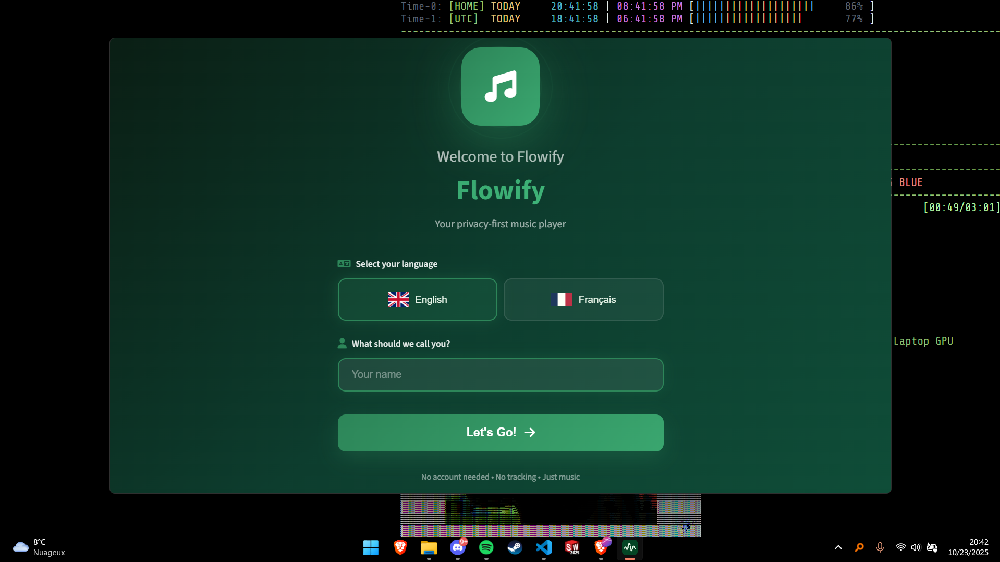
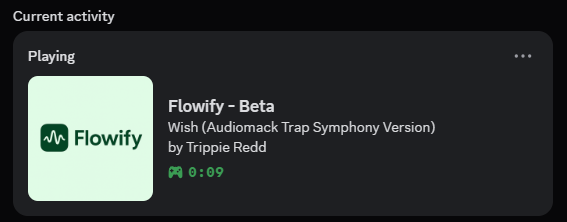

# 🎵 Flowify Music Player - Beta

<div align="center">


**A free, privacy-focused music player built with Electron**

*No account required • No tracking • No ads*

[Download Latest Release](https://github.com/naplon74/flowify-music-player/releases) • [Report Bug](https://github.com/naplon74/flowify-music-player/issues) • [Request Feature](https://github.com/naplon74/flowify-music-player/issues)

</div>

---

> [!WARNING]  
> The app is in "Beta" meaning it is still unstable and you may experience issue. I suggest you make a backup of your playlist before an update.


## ✨ Features

### 🎧 Core Functionality
- **High-Quality Streaming** - Stream music in lossless quality (FLAC/LOSSLESS)
- **Smart Search** - Find any track, artist, or album instantly
- **Custom Playlists** - Create, edit, and manage your music collections
- **Liked Songs** - Build your personal favorites library
- **Offline Downloads** - Download tracks for offline listening
- **Artist Pages** - Explore full artist discographies
- **Albums** - Explore albums (COMING SOON)

### 🎨 User Experience
- **Modern UI** - Clean, intuitive interface with smooth animations
- **Dark & Light Themes** - Choose your preferred visual style
- **Custom Themes** - Fully customizable CSS themes (colors, fonts, effects)
- **Custom Window Controls** - Frameless design with integrated controls
- **System Tray Integration** - Minimize to tray and control playback
- **Discord Rich Presence** - Show what you're listening to on Discord (BROKEN, SO FIXING IT)
- **Auto-Updates** - Seamless background updates via GitHub releases

### 🔒 Privacy First
- **No Account Required** - Start listening immediately
- **No Tracking** - Your listening history stays on your device
- **No Ads** - Uninterrupted music experience
- **Local Storage** - All preferences and playlists stored locally

### 🎛️ Audio Controls
- **Playback Controls** - Play, pause, skip, shuffle, repeat
- **Volume Control** - Smooth volume adjustment with memory
- **Progress Seeking** - Jump to any point in a track
- **Queue Management** - View and control your play queue

### 🎨 Custom Themes
Flowify supports fully customizable CSS themes! Change colors, fonts, animations, and more.

**Quick Start:**
1. Download `custom-theme-template.css`
2. Customize the colors and styles
3. Rename to `custom-theme.css` and place in the Flowify folder
4. Restart Flowify to see your changes

**Pre-made Themes Available:**
- 🌃 Cyberpunk Neon - Futuristic pink and cyan
- 🌊 Ocean Breeze - Calming blue tones
- 🌸 Cherry Blossom - Soft pink elegance

📚 **Documentation:**
- **[Custom Theme Guide](CUSTOM_THEME_GUIDE.md)** - Full customization guide
- **[Quick Reference](THEME_QUICK_REFERENCE.md)** - Common customizations
- **[Pre-made Themes](themes/)** - Ready-to-use themes

---

## 📸 Screenshots




---

## 🛠️ Tech Stack

### Core Technologies
- **[Electron](https://www.electronjs.org/)** - Cross-platform desktop framework
- **JavaScript** - Application logic
- **HTML5 & CSS3** - User interface
- **Node.js** - Backend runtime

### Key Libraries
- **[electron-updater](https://www.electron.build/auto-update)** - Automatic updates
- **[discord-rich-presence](https://www.npmjs.com/package/discord-rich-presence)** - Discord integration
- **[electron-builder](https://www.electron.build/)** - Application packaging

### Architecture
- **Main Process** (`main.js`) - Electron main process, window management, IPC
- **Renderer Process** (`script.js`) - UI logic, playback control
- **Preload Script** (`preload.js`) - Secure IPC bridge
- **Local Storage** - Persistent data (playlists, preferences)

---

## 📦 Project Structure

```
flowify-music-player/
├── assets/              # Icons and static resources
├── dist/                # Build output (generated)
├── main.js              # Electron main process
├── preload.js           # Preload script for IPC
├── index.html           # Main UI markup
├── script.js            # Renderer process logic
├── styles.css           # Application styles
├── package.json         # Dependencies and scripts
└── electron-builder.json # Build configuration
```

---

## 🔄 Auto-Update System

Flowify includes a seamless auto-update system:

1. **Silent Check** - App checks for updates on launch
2. **Notification** - Only notifies if an update is available
3. **User Control** - You decide when to download and install
4. **Background Download** - Updates download without interrupting playback
5. **Install on Quit** - Updates install when you close the app

---

## 🤝 Contributing

Contributions are welcome! Here's how you can help:

### Reporting Bugs
1. Check if the bug has already been reported
2. Open a [new issue](https://github.com/naplon74/flowify-music-player/issues/new)
3. Include:
   - Clear description
   - Steps to reproduce
   - Expected vs actual behavior
   - Screenshots (if applicable)
   - OS and app version

### Suggesting Features
1. Open a [feature request](https://github.com/naplon74/flowify-music-player/issues/new)
2. Describe the feature and its use case
3. Explain why it would benefit users

---

- Album artwork from **TIDAL Resources**
- Icons from **[Font Awesome](https://fontawesome.com/)**
- Built with ❤️ by Naplon_

---

## 📞 Support

- **Issues**: [GitHub Issues](https://github.com/naplon74/flowify-music-player/issues)
- **Discussions**: [GitHub Discussions](https://github.com/naplon74/flowify-music-player/discussions)

---

## 🗺️ Roadmap

### Upcoming Features (✅= Release in next update | ⚠️= Experimental release)
- [ ] Lyrics support (⚠️)
- [ ] Equalizer and audio effects (✅)
- [ ] Keyboard shortcuts customization (✅)
- [ ] Mini player mode (✅)
- [ ] Visualizer (✅)

### Known Issues
- See [Issues](https://github.com/naplon74/flowify-music-player/issues) for current bugs and feature requests

---

<div align="center">

**Made with ❤️ for music lovers by Naplon_**

⭐ Star this repo if you like Flowify! ⭐

**Flowify is intended for educational and legal use only. You are solely responsible for the content you access.**

[Report Bug](https://github.com/naplon74/flowify-music-player/issues) • [Request Feature](https://github.com/naplon74/flowify-music-player/issues) • [Contribute](#-contributing)

</div>
